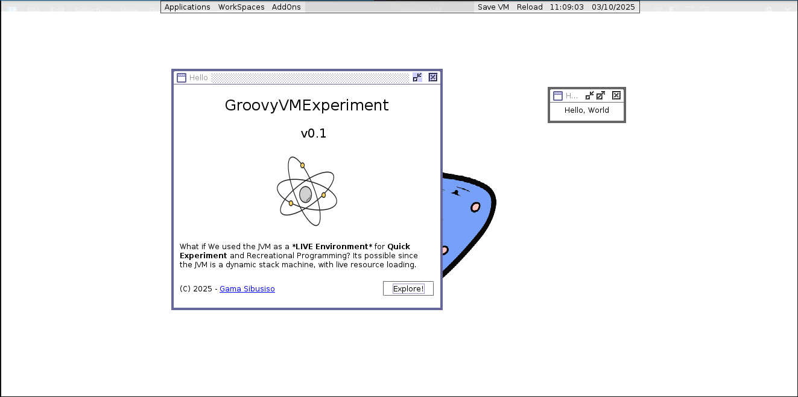
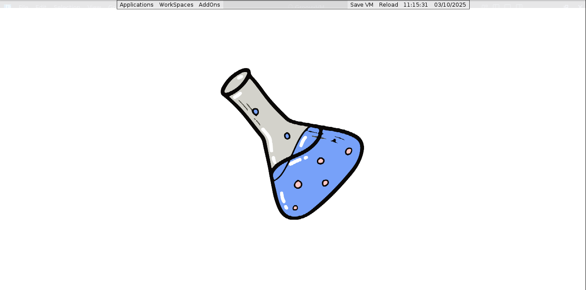

# LiveGroovyExperiment

<div align="center">


</div>

>> The goal is to create a LIVE Envornment for Programming in Groovy inspired by Interlisp, 
Smalltalk etc. 
>> The VM must be reflective and dynamic. Groovy is perfect for that.

## Motive
Well think about, the JVM is simply a virtual machine and it is dynamic but I have never seen a Smalltalk like environment for JVM. I think the main reason is that JVM languages are mostly static typed and generate bytecode from typed programs. 

Groovy allows a syntax nearly identical to java but it break the type dependency and generates byte code that is dynamic. Why not make one, in groovy?

## Groovy Advantages
- Can execute from a string at runtime
- Has seamless intergration with Java and the JVM
- Metaprogramming
- Dynamic typing
- Checked Optional Static Typing

## Screenshots

<table>
    <tr>
        <th colspan="2">Latest Screenshots</th>
    </tr>
    <tr>
        <td></td>
        <td></td>
    </tr>
    <tr>
        <td>The VM rendering the welcome window.</td>
        <td>The VM showing the desktop with a wallpaper</td>
    </tr>
</table>


## Building
#### Requirements
- *JVM*
- *Gradle*
- *Groovy*

#### Build Steps
```sh

$ git clone git@github.com:hexaredecimal/GroovyVMExperiment.git
$ cd GroovyVMExperiment
$ cd gradle run
```


## References
- [Pharo SmallTalk](https://pharo.org/)
- [Squeak](https://squeak.org/)
- [Interlisp](https://interlisp.org/)


